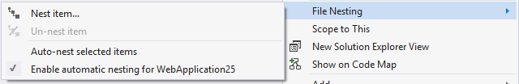
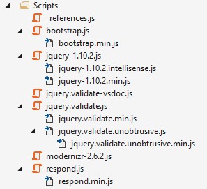
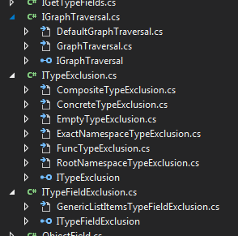

# File Nesting

Download File Nesting from the [VS Gallery](http://visualstudiogallery.msdn.microsoft.com/3ebde8fb-26d8-4374-a0eb-1e4e2665070c)
or get the [CI build](http://vsixgallery.com/extension/6c799bc4-0d4c-4172-98bc-5d464b612dca/).

---------------------------------------------------------------

Automatically nest files based on file name and enables
developers to nest and unnest any file manually

See the
[demo video](http://channel9.msdn.com/Blogs/MadsKristensen/Introducing-File-Nestor-for-Visual-Studio)
on Channel 9.

## Features

- Manually nest files
- Manually un-nest files
- Auto-nesting based on naming conventions
- Option to enable auto-nesting when files are added or renamed
- Options to specify which naming conventions to apply
- Keyboard shortcut for manual nesting (Ctrl+Alt+N)

You can both nest and un-nest any file with ease.

File Nesting also gives you the option to automatically nest
based on file naming rules. You can then apply those rules to
any files, folders or entire projects.

Here's a screenshot of that:

## Known issues

Due to missing or limited support for file nesting in certain
project types, this extension will have no effect or be
disabled. The project types are:

- Node.js projects (NTVS)
- ASP.NET Core (has built in rules for nesting)
- Apache Cordova
- Shared projects

There is nothing this extension can do to provide nesting
in those project types. The support has to be added to the
project type itself before support can be added.

## Contribute
Check out the [contribution guidelines](.github/CONTRIBUTING.md)
if you want to contribute to this project.

For cloning and building this project yourself, make sure
to install the
[Extensibility Tools 2015](https://visualstudiogallery.msdn.microsoft.com/ab39a092-1343-46e2-b0f1-6a3f91155aa6)
extension for Visual Studio which enables some features
used by this project.

## License
[Apache 2.0](LICENSE)